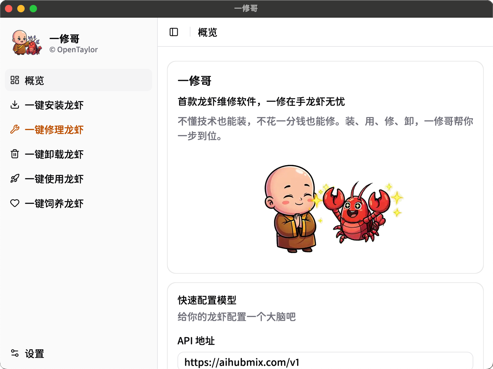
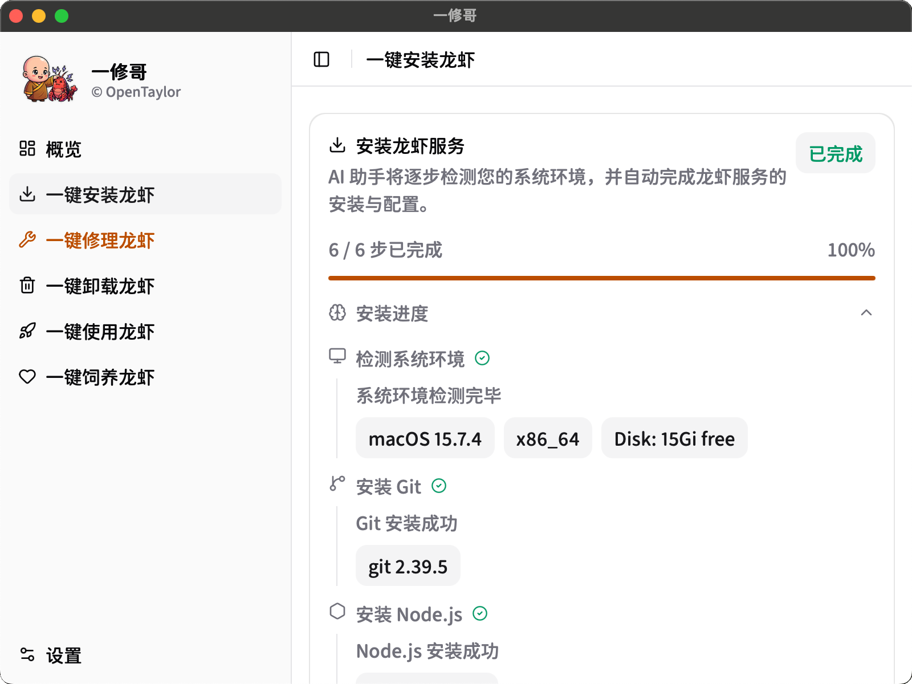
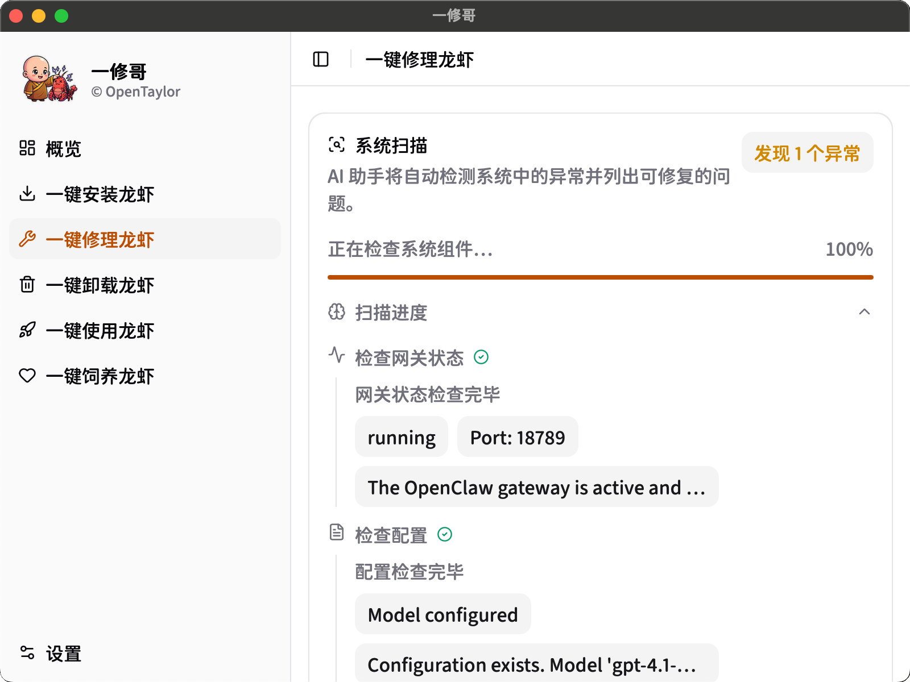
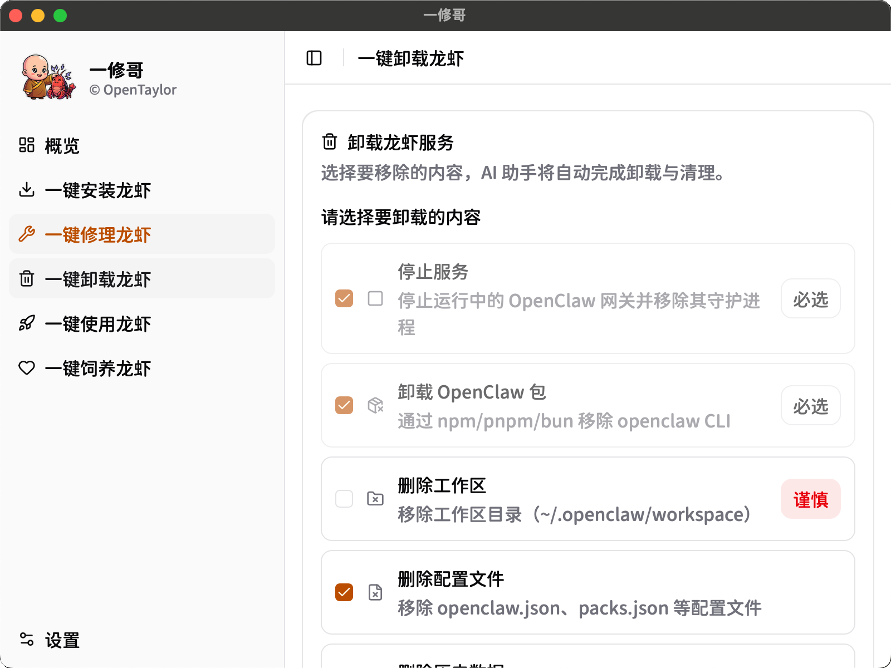
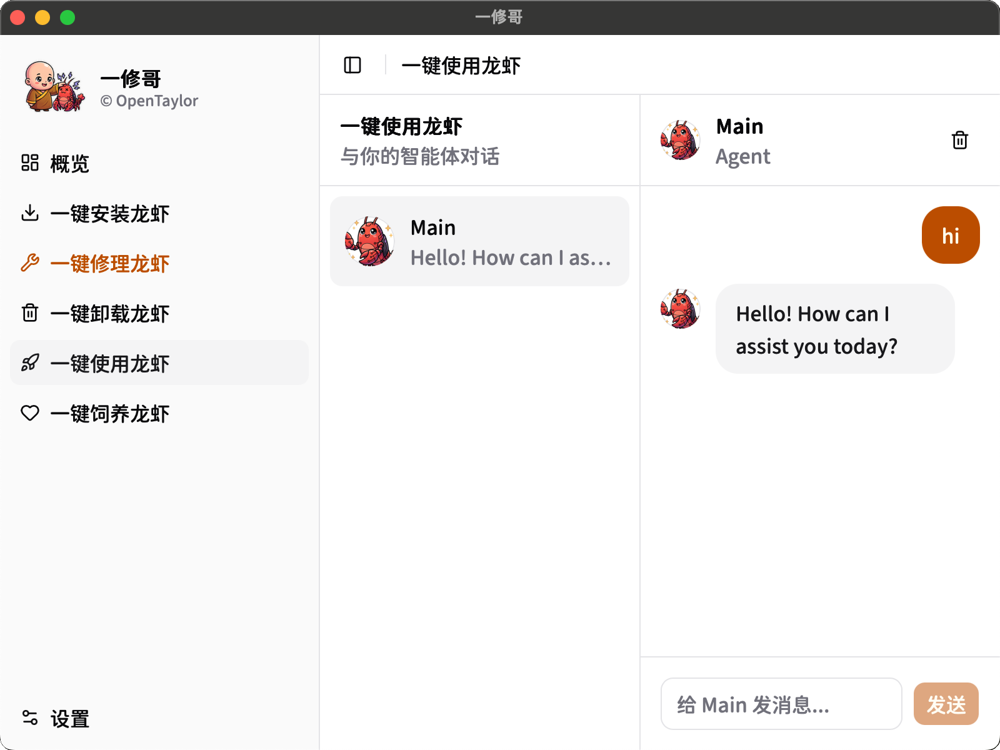
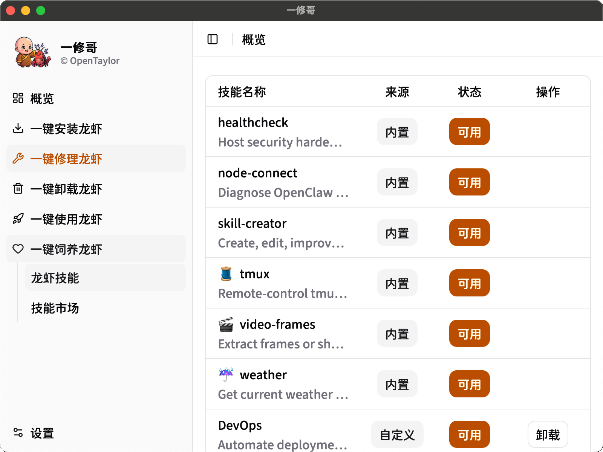

<div align="center">


# 一修哥 (TaylorIssue)

全球唯一一款 OpenClaw 维修软件，管理智能体的智能体。

[](LICENSE)
[]()
[](https://tauri.app/)
[](https://react.dev/)
[]()

[[English README](README.md)]

*不懂技术也能装，不花一分钱也能修。*
*装、用、修、卸，一修哥帮你一步到位。*

</div>

## 动态

[2026-03-21] 发布 v0.1.0 版本，支持 macOS 和 Windows。

## 什么是一修哥

一修哥 (TaylorIssue) 是一款用于安装、使用、修理和管理 [OpenClaw](https://github.com/nicepkg/openclaw)（开源 AI 智能体框架）的桌面应用。它是管理智能体的智能体，通过 AI 自动完成 OpenClaw 全生命周期的每一步操作，让你无需接触终端命令行。

### 核心功能

- 一键安装，AI 引导式安装流程，自动检测系统环境并安装 Git、Node.js 和 OpenClaw
- 一键修理，系统扫描与自动诊断，一键修复常见问题，还支持自定义问题描述由 AI 进行智能诊断
- 一键卸载，精细化清理，可选择性移除服务、软件包、工作区、配置文件和历史数据
- 智能体对话，在应用内直接与 OpenClaw 智能体对话
- 技能管理，浏览、安装和管理智能体技能，支持本地技能和 ClawHub 社区市场
- 模型配置，秒级完成 LLM 服务商配置，内置免费 API 服务商指南

## 快速上手

### 概览

仪表盘提供一修哥的全局视图、快速模型配置和项目元信息。

<div align="center">

</div>

### 一键安装

一键安装 OpenClaw。AI 助手将自动完成系统环境检测、Git 安装、Node.js 安装、OpenClaw 安装、配置和网关验证，全程无需手动干预。

<div align="center">

</div>

### 一键修理

系统扫描与修复。自动检测服务停止、配置缺失、证书过期、磁盘不足等异常，支持自动修复和自定义问题描述由 AI 进行智能诊断。

<div align="center">

</div>

### 一键卸载

精细化卸载，可自由选择要移除的内容，包括服务、软件包、工作区、配置文件和历史数据。

<div align="center">

</div>

### 智能体对话

直接与 OpenClaw 智能体聊天。在侧边栏选择可用的智能体即可开始对话。

<div align="center">

</div>

### 技能管理

查看和管理已安装的 OpenClaw 技能，浏览 ClawHub 社区市场，一键发现和安装新技能。

<div align="center">

</div>

## 安装

### 环境要求

- [Node.js](https://nodejs.org/)（>= 18）及 pnpm
- [Rust](https://www.rust-lang.org/tools/install) 工具链（Tauri 所需）
- Tauri 系统依赖，详见 [Tauri 环境准备指南](https://v2.tauri.app/start/prerequisites/)

### 从源码构建

```bash
git clone https://github.com/tczhangzhi/taylorissue.git
cd taylorissue
pnpm install
pnpm tauri dev
```

生产环境构建请运行 `pnpm build && pnpm tauri build`。

## 开发

| 命令 | 说明 |
|------|------|
| `pnpm dev` | 启动 Vite 开发服务器，仅前端，端口 1420 |
| `pnpm tauri dev` | 启动完整的 Tauri 应用（开发模式） |
| `pnpm build` | 构建前端生产版本 |
| `pnpm tauri build` | 构建可分发的桌面应用 |

## 路线图

- [ ] 记忆（Memory），让知识管理不再困难
- [ ] 技能（Skill），让工具使用不再困难
- [ ] 定时（Cron），让主动交互不再困难
- [ ] 安全（Security），让隐私保护不再困难
- [ ] 多智能体（Multi-Agent），让协作扩展不再困难
- [ ] 产出（Artifact），让交付输出不再困难

## 致谢

维护者

- 张智，博士生，香港理工大学电子计算学系
- 刘焱，教授，香港理工大学电子计算学系

赞助者

- 陈功，博士，香港理工大学电子计算学系，致心科技、飚撼科技创始人

## 许可证

[MIT 协议](LICENSE) © 2026 OpenTaylor
